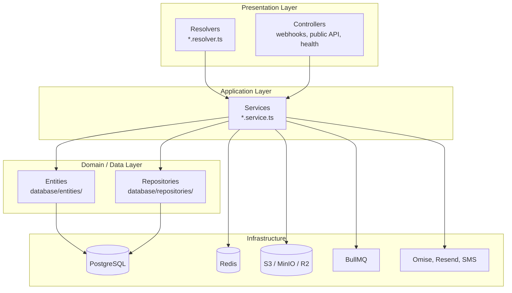

# Backend Architecture

## Pattern

**NestJS modular monolith** with code-first GraphQL. Business logic lives in injectable services; API surface is primarily GraphQL resolvers.



## Why this organization

- **Modules per domain** — each feature (orders, products, search) is self-contained with its own module, service, and resolver.
- **GraphQL aggregation** — `AppGraphqlModule` imports GraphQL feature modules and exposes a single `/graphql` endpoint.
- **Services own business rules** — resolvers are thin: validate input, call service, map to GraphQL type.
- **Global guards** — JWT and suspension checks apply everywhere unless opted out with `@Public()` / `@AllowSuspendedStore()`.

## Module registration

### Globals (`src/app.module.ts`)

```typescript
{ provide: APP_PIPE, useClass: ValidationPipe },
{ provide: APP_GUARD, useClass: JwtAuthGuard },
{ provide: APP_GUARD, useExisting: StoreStatusGuard },
{ provide: APP_GUARD, useExisting: CustomerStatusGuard },
{ provide: APP_FILTER, useClass: HttpExceptionFilter },
{ provide: APP_INTERCEPTOR, useClass: LoggingInterceptor },
```

`RolesGuard` is **not** global — apply `@UseGuards(RolesGuard)` together with `@Roles(...)` on handlers that need it.

### Direct `AppModule` imports

`QueueModule.forRoot()`, `RedisModule`, `EmailModule`, `AuthModule`, `UsersModule`, `StoresModule`, `ProductsModule`, `OrdersModule`, `PaymentsModule`, `CartModule`, `StorageModule`, `PlatformModule`, `AdminTeamModule`, `PublicApiModule`, `SearchModule`, `AppGraphqlModule`, `HealthModule`, `AuditLogsModule`.

TypeORM is wired with `TypeOrmModule.forRootAsync` inside `AppModule` (not via unused `DatabaseModule`).

### GraphQL-only / nested modules

`AppGraphqlModule` additionally imports (among overlaps): `PromotionsModule`, `ReviewsModule`, `PayoutsModule`, `AnalyticsModule`, `NotificationsModule`, `TaxonomyModule`, `CustomersModule`, `ApiKeysModule`.

Transitive / peer infrastructure modules (not always listed on `AppModule`):

| Module      | Typically imported by            |
| ----------- | -------------------------------- |
| `sms`       | `AuthModule`                     |
| `omise`     | `StoresModule`, `PayoutsModule`  |
| `inventory` | `OrdersModule`, `PaymentsModule` |

## Feature modules

| Module        | Path                     | GraphQL   | REST           | Primary responsibility                                                    |
| ------------- | ------------------------ | --------- | -------------- | ------------------------------------------------------------------------- |
| auth          | `modules/auth/`          | ✓         | —              | OTP, JWT, login, password reset, email verification                       |
| users         | `modules/users/`         | ✓         | —              | Customer account, addresses, favorites                                    |
| customers     | `modules/customers/`     | ✓         | —              | Admin customer management                                                 |
| stores        | `modules/stores/`        | ✓         | —              | Store CRUD, team, shipping, invitations                                   |
| products      | `modules/products/`      | ✓         | —              | Product catalog, variants, images                                         |
| taxonomy      | `modules/taxonomy/`      | ✓         | —              | Categories, pet types, brands, tags                                       |
| cart          | `modules/cart/`          | ✓         | —              | Guest + auth carts, merge on login                                        |
| orders        | `modules/orders/`        | ✓         | —              | Order creation, fulfillment, status, tracking                             |
| payments      | `modules/payments/`      | ✓         | ✓ webhook      | Omise charges, payment expiry                                             |
| payouts       | `modules/payouts/`       | ✓         | —              | Vendor payout scheduling (BullMQ)                                         |
| promotions    | `modules/promotions/`    | ✓         | —              | Platform + store promotions                                               |
| reviews       | `modules/reviews/`       | ✓         | —              | Product reviews, vendor replies                                           |
| analytics     | `modules/analytics/`     | ✓         | —              | Dashboard metrics                                                         |
| platform      | `modules/platform/`      | ✓         | —              | Banners, sponsors, ads                                                    |
| admin-team    | `modules/admin-team/`    | ✓         | —              | Admin team invitations                                                    |
| notifications | `modules/notifications/` | ✓         | —              | In-app + email notifications                                              |
| storage       | `modules/storage/`       | ✓         | —              | Image upload (S3/MinIO/R2)                                                |
| search        | `modules/search/`        | ✓         | —              | Smart search, synonyms, embeddings, analytics                             |
| api-keys      | `modules/api-keys/`      | ✓         | —              | Store API key management                                                  |
| audit-logs    | `modules/audit-logs/`    | ✓         | —              | `@Global()` admin action audit trail                                      |
| public-api    | `modules/public-api/`    | —         | ✓              | `POST /api/v1/stores/:id/products`                                        |
| health        | `modules/health/`        | ✓ (query) | ✓ (`/health*`) | Terminus-ready REST checks; GraphQL `health` in `graphql/app.resolver.ts` |
| email         | `modules/email/`         | —         | —              | `@Global()` Resend; templates use logo at `${API_URL}/images/email/…`     |
| sms           | `modules/sms/`           | —         | —              | OTP SMS delivery                                                          |
| redis         | `modules/redis/`         | —         | —              | `@Global()` Redis client (disabled when `REDIS_HOST` unset)               |
| omise         | `modules/omise/`         | —         | —              | Omise SDK wrapper                                                         |
| queue         | `modules/queue/`         | —         | —              | `@Global()` BullMQ connection setup (`QueueModule.forRoot()`)             |
| inventory     | `modules/inventory/`     | —         | —              | Inventory transactions (service only)                                     |

**Reserved, not wired:** `Dispute`, `DisputeItem`, `DisputeMessage`, `DisputeImage` entities and their migrations exist under `src/database/entities/` for a returns/disputes feature, but there is no `modules/disputes/` service, resolver, or GraphQL surface — columns/relations such as `Order.disputes` are unused by running code paths.

## GraphQL module

`src/graphql/graphql.module.ts`:

- `ApolloDriver` with `autoSchemaFile` → `src/schema.gql` (absolute via `join(process.cwd(), 'src/schema.gql')`)
- Playground enabled when `NODE_ENV !== 'production'`
- `graphql-ws` subscriptions (payment status)
- Context factory attaches DataLoaders (`src/graphql/loaders/`)
- `formatError` uses `exception-response.util.ts`

## Dependency direction

```
Resolver / Controller → Service → Repository / Entity / Other Service → Infrastructure
```

Resolvers must not access TypeORM repositories directly — always go through services.

## Transactions

Critical writes use `DataSource.transaction()` (see `orders.service.ts` for create-order + stock lock pattern).

## Async side effects

Non-critical work (e.g. vendor notifications) may be fire-and-forget:

```typescript
this.notificationsService.notifyVendorsAboutNewOrder(order).catch(() => {});
```

## Related docs

- [Folder structure](folder-structure.md)
- [API](api.md)
- [Feature development](feature-development.md)
