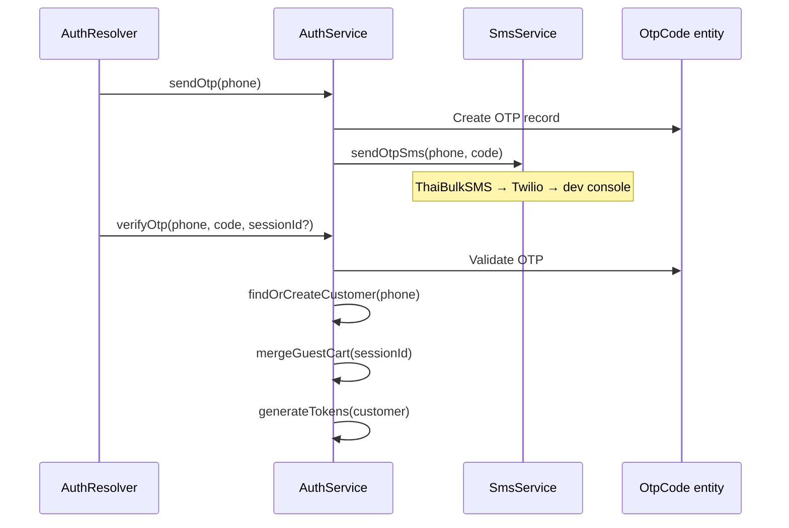

# Backend Authentication

## Auth models

| Role     | Login method     | GraphQL mutations                      | Entity                |
| -------- | ---------------- | -------------------------------------- | --------------------- |
| Customer | Phone OTP        | `sendCustomerOtp`, `verifyCustomerOtp` | `Customer`            |
| Vendor   | Email + password | `vendorLogin`                          | `User` (role: vendor) |
| Admin    | Email + password | `adminLogin`                           | `User` (role: admin)  |

All paths issue JWT access + refresh tokens via `auth.service.ts` → `generateTokens()`.

## Customer OTP flow



**Files:**

- `src/modules/auth/auth.resolver.ts`
- `src/modules/auth/auth.service.ts`
- `src/modules/sms/sms.service.ts`
- `src/database/entities/otp-code.entity.ts`
- `src/common/utils/phone.util.ts`

## Vendor/admin login

```typescript
// auth.service.ts — login()
const user = await this.userRepository.findByEmail(email);
const valid = await bcrypt.compare(password, user.passwordHash);
// Resolve storeId for vendors
return this.generateTokens({ sub: user.id, role: user.role, storeId });
```

Password hashing: bcrypt cost 12.

## JWT infrastructure

### Strategy

`src/modules/auth/strategies/jwt.strategy.ts`:

```typescript
super({
  jwtFromRequest: ExtractJwt.fromAuthHeaderAsBearerToken(),
  secretOrKey: configService.get('jwt.secret'),
});
```

### Global guard

`JwtAuthGuard` registered as `APP_GUARD` in `app.module.ts`:

- Checks `@Public()` metadata — allows unauthenticated access
- Still parses token if present (for optional auth on public routes)
- Attaches user to request for `@CurrentUser()`

### Role guard

```typescript
@UseGuards(JwtAuthGuard, RolesGuard)
@Roles('admin', 'vendor')
@Mutation(() => ProductType)
async createProduct(...) {}
```

### Decorators

| Decorator                | File                                                   | Purpose                 |
| ------------------------ | ------------------------------------------------------ | ----------------------- |
| `@Public()`              | `common/decorators/public.decorator.ts`                | Skip auth requirement   |
| `@Roles(...)`            | `common/decorators/roles.decorator.ts`                 | Require specific roles  |
| `@CurrentUser()`         | `common/decorators/current-user.decorator.ts`          | Extract JWT payload     |
| `@AllowSuspendedStore()` | `common/decorators/allow-suspended-store.decorator.ts` | Bypass store suspension |

### Suspension guards

| Guard                 | Blocks                           |
| --------------------- | -------------------------------- |
| `StoreStatusGuard`    | Suspended vendor store mutations |
| `CustomerStatusGuard` | Suspended customer actions       |

Both registered globally in `app.module.ts`.

### Rate limiting

`AuthRateLimitGuard` — Redis-backed limits on OTP send, login, password reset.

## Token refresh

`auth.resolver.ts` → `refreshToken` mutation:

- Validates refresh token `type` field
- Issues new access + refresh pair

## Password reset

1. `requestPasswordReset(email)` — creates token, sends email via Resend
2. `resetPassword(token, newPassword)` — validates token, updates hash

Entity: `password-reset-token.entity.ts`

## Store API keys

For vendor REST API (`public-api` module):

```typescript
// api-key.guard.ts
// Authorization: Bearer sopet_sk_...
// or X-Api-Key header
```

## JWT payload

`src/common/interfaces/index.ts`:

```typescript
interface JwtPayload {
  sub: string;
  role: 'customer' | 'vendor' | 'admin';
  phone?: string;
  storeId?: string;
  type?: 'access' | 'refresh';
}
```

## Environment

```env
JWT_SECRET=change-me-to-a-long-random-string-in-production
JWT_ACCESS_EXPIRES_IN=1h
JWT_REFRESH_EXPIRES_IN=7d
```

## Related docs

- [Workspace authentication](../../new-sopet-workspace/docs/developer/authentication.md)
- [API layer](api.md)
