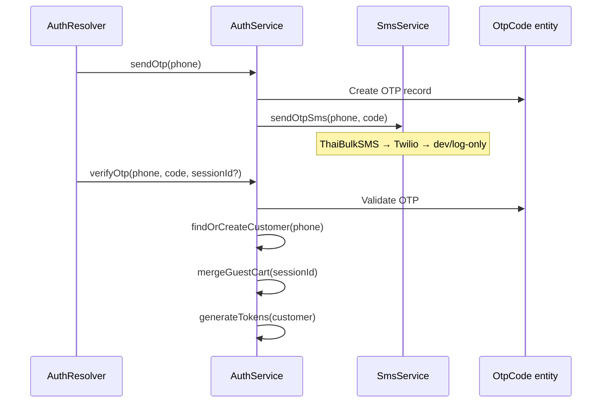

# Backend Authentication

## Auth models

| Role     | Login method     | GraphQL mutations                      | Entity                |
| -------- | ---------------- | -------------------------------------- | --------------------- |
| Customer | Phone OTP        | `sendCustomerOtp`, `verifyCustomerOtp` | `Customer`            |
| Vendor   | Email + password | `vendorLogin`                          | `User` (role: vendor) |
| Admin    | Email + password | `adminLogin`                           | `User` (role: admin)  |

All paths issue JWT access + refresh tokens via `auth.service.ts` → `generateTokens()`.

## Customer OTP flow



**Files:**

- `src/modules/auth/auth.resolver.ts`
- `src/modules/auth/auth.service.ts`
- `src/modules/sms/sms.service.ts`
- `src/database/entities/otp-code.entity.ts`
- `src/common/utils/phone.util.ts`

### SMS configuration

`SmsService` delivery order:

1. **Development** (`NODE_ENV=development`) — logs OTP to server console; no provider call
2. **Log-only** (`SMS_OTP_LOG_ONLY=true`) — same as dev; for UAT when real SMS is unavailable
3. **ThaiBulkSMS** — when `THAIBULKSMS_API_KEY` and `THAIBULKSMS_API_SECRET` are set
4. **Twilio** — fallback when `TWILIO_ACCOUNT_SID`, `TWILIO_AUTH_TOKEN`, `TWILIO_PHONE_NUMBER` are set
5. Otherwise throws `SMS_NOT_CONFIGURED`

UAT deploy requires `THAIBULKSMS_API_KEY` and `THAIBULKSMS_API_SECRET` (GitHub Environment secrets). Optional: `THAIBULKSMS_SENDER`, `THAIBULKSMS_FORCE` (default `corporate`), `THAIBULKSMS_SHORTEN_URL` (default `false`).

Provider failures return `SMS_DELIVERY_FAILED` (not a generic 500). See `docs/troubleshooting.md` for error codes.

```typescript
// auth.service.ts — login()
const user = await this.userRepository.findByEmail(email);
const valid = await bcrypt.compare(password, user.passwordHash);
// Resolve storeId for vendors
return this.generateTokens({ sub: user.id, role: user.role, storeId });
```

Password hashing: bcrypt cost 12.

## JWT infrastructure

### Strategy

`src/modules/auth/strategies/jwt.strategy.ts`:

```typescript
super({
  jwtFromRequest: ExtractJwt.fromAuthHeaderAsBearerToken(),
  secretOrKey: configService.get('jwt.secret'),
});
```

### Global guard

`JwtAuthGuard` registered as `APP_GUARD` in `app.module.ts`:

- Checks `@Public()` metadata — allows unauthenticated access
- Still parses token if present (for optional auth on public routes)
- Attaches user to request for `@CurrentUser()`

### Role guard

```typescript
@UseGuards(JwtAuthGuard, RolesGuard)
@Roles('admin', 'vendor')
@Mutation(() => ProductType)
async createProduct(...) {}
```

### Decorators

| Decorator                | File                                                   | Purpose                 |
| ------------------------ | ------------------------------------------------------ | ----------------------- |
| `@Public()`              | `common/decorators/public.decorator.ts`                | Skip auth requirement   |
| `@Roles(...)`            | `common/decorators/roles.decorator.ts`                 | Require specific roles  |
| `@CurrentUser()`         | `common/decorators/current-user.decorator.ts`          | Extract JWT payload     |
| `@AllowSuspendedStore()` | `common/decorators/allow-suspended-store.decorator.ts` | Bypass store suspension |

### Suspension guards

| Guard                 | Blocks                           |
| --------------------- | -------------------------------- |
| `StoreStatusGuard`    | Suspended vendor store mutations |
| `CustomerStatusGuard` | Suspended customer actions       |

Both registered globally in `app.module.ts`.

### Rate limiting

`AuthRateLimitGuard` — Redis-backed limits on OTP send, login, password reset.

## Token refresh

`auth.resolver.ts` → `refreshToken` mutation:

- Validates refresh token `type` field
- Issues new access + refresh pair

## Password reset

1. `requestPasswordReset(email)` — creates token, sends email via Resend
2. `resetPassword(token, newPassword)` — validates token, updates hash

Entity: `password-reset-token.entity.ts`

## Vendor email verification

Vendors (`User` with `role: vendor`) have `emailVerified` (default `false`). Verification is required **only before creating a new store** — not for joining existing stores as a team member.

### When verification is required (product flow)

| Step                                                           | Verification required?                                             |
| -------------------------------------------------------------- | ------------------------------------------------------------------ |
| Vendor self-registration (`registerVendor`)                    | No — account created; verification email sent                      |
| Vendor login                                                   | No                                                                 |
| Accept vendor platform invite (`acceptVendorInvitation`)       | No — account created; verification email sent                      |
| Accept **store member** invite (`acceptStoreMemberInvitation`) | **No** — can join team without verified email                      |
| Submit **new store** request (`submitStoreRequest`)            | **Yes** — blocked with `EMAIL_NOT_VERIFIED`                        |
| Legacy `registerStore` (register + store in one call)          | Registers only; store request must be submitted after verification |
| Admin creates store for vendor (`createStoreAsAdmin`)          | **No** — admin bypass                                              |
| Admin approves pending store request                           | No — approval is admin action                                      |

### Verified vs unverified behavior

| Capability                           | Unverified                    | Verified               |
| ------------------------------------ | ----------------------------- | ---------------------- |
| Login / dashboard access             | Yes                           | Yes                    |
| Join store via member invitation     | Yes                           | Yes                    |
| Switch between stores (member/owner) | Yes                           | Yes                    |
| Submit new store request             | **No** (`EMAIL_NOT_VERIFIED`) | Yes                    |
| Admin manual verify / resend         | Available                     | N/A (already verified) |

No other features are gated by `emailVerified` today (products, orders, payouts, etc. use store membership and store status instead).

### GraphQL

| Operation                                      | Auth       | Purpose                    |
| ---------------------------------------------- | ---------- | -------------------------- |
| `verifyEmail(input: { token })`                | Public     | Confirm email via link     |
| `resendEmailVerification`                      | Vendor JWT | Self-service resend        |
| `adminResendVendorEmailVerification(vendorId)` | Admin      | Resend on behalf of vendor |
| `adminVerifyVendorEmail(vendorId)`             | Admin      | Manual override            |

`UserProfile.emailVerified` is returned on login, `me`, and registration payloads.

### Local development

1. **Seed vendors** — `yarn seed` sets `emailVerified: true` for seeded vendors (`vendor@sopet.org`).
2. **Dev email logging** — In `NODE_ENV=development`, `EmailService` logs email body to the backend console (not sent via Resend). `EmailDeliveryService` also logs actionable URLs, e.g. `[dev] Email verification -> vendor@test.com | http://localhost:3001/verify-email?token=...`
3. **Verify via link** — Copy the `verify-email?token=` URL from backend logs into the browser (admin app port **3001**).
4. **Admin manual verify** — Admin → Vendors → vendor detail → “ยืนยันอีเมลด้วยตนเอง”.
5. **Admin resend** — Same page → “ส่งอีเมลยืนยันอีกครั้ง”.
6. **Vendor self resend** — Vendor stores page → store request section → “ส่งอีเมลยืนยันอีกครั้ง”.

**Environment variables**

| Variable                           | Default (local)                             | Used for                          |
| ---------------------------------- | ------------------------------------------- | --------------------------------- |
| `ADMIN_PANEL_URL`                  | `http://localhost:3001`                     | Verification, reset, invite links |
| `STOREFRONT_URL`                   | `http://localhost:3000`                     | Email logo asset URL              |
| `RESEND_API_KEY`                   | unset in dev                                | Production email delivery         |
| `RESEND_FROM` / `RESEND_FROM_NAME` | `noreply@sopet.co.th` / `SOPet Marketplace` | From address                      |

Registration and admin resend call `AuthService.createAndSendEmailVerificationToken()` (24h expiry, single use).

### Email templates

All transactional emails go through `EmailDeliveryService` → `email-templates.ts` shared `layout()` (SOPet header, logo, footer). Templates: vendor invite, admin invite, store member invite, password reset, email verification, order paid, order status changed.

## Store API keys

For vendor REST API (`public-api` module):

```typescript
// api-key.guard.ts
// Authorization: Bearer sopet_sk_...
// or X-Api-Key header
```

## JWT payload

`src/common/interfaces/index.ts`:

```typescript
interface JwtPayload {
  sub: string;
  role: 'customer' | 'vendor' | 'admin';
  phone?: string;
  storeId?: string;
  type?: 'access' | 'refresh';
}
```

## Environment

```env
JWT_SECRET=change-me-to-a-long-random-string-in-production
JWT_ACCESS_EXPIRES_IN=1h
JWT_REFRESH_EXPIRES_IN=7d
```

## Related docs

- [Workspace authentication](../../new-sopet-workspace/docs/developer/authentication.md)
- [API layer](api.md)
