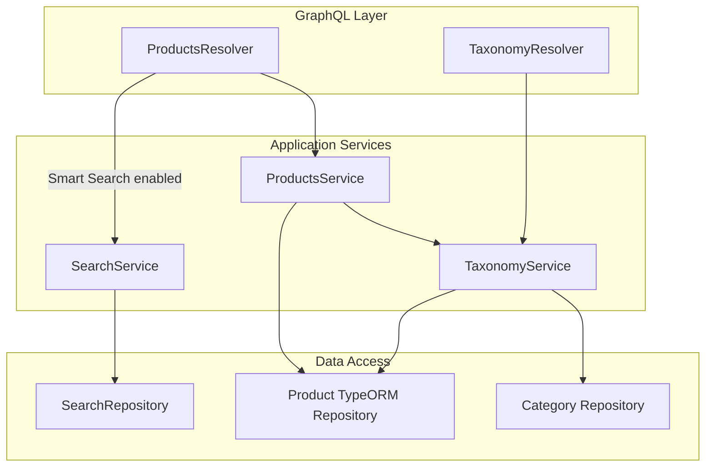
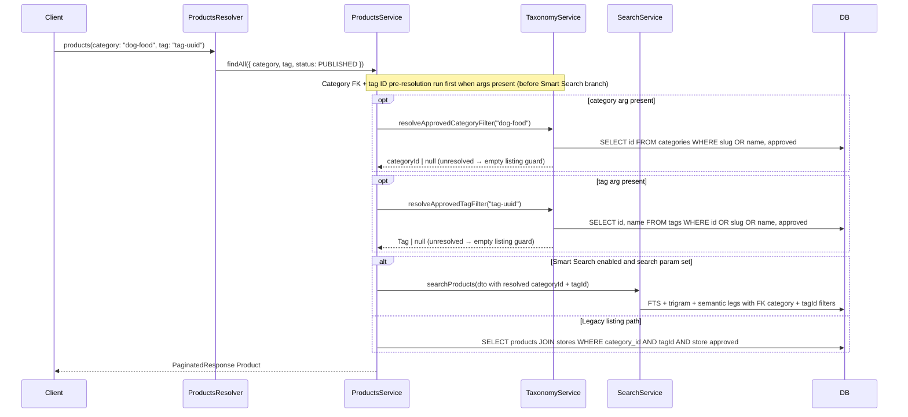
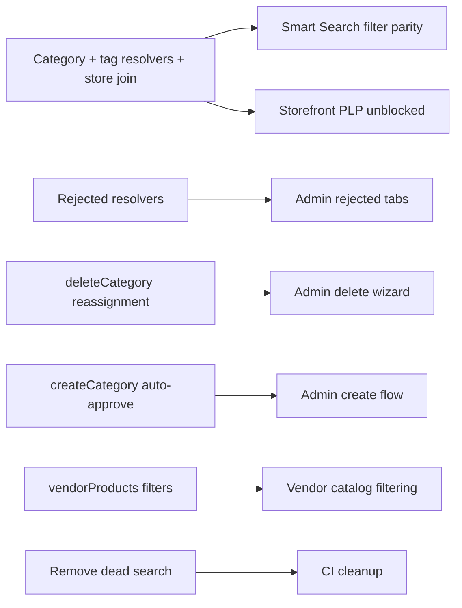

# Search & Taxonomy Fixes — Backend Design Document

**Version**: 1.2  
**Date**: 2026-07-11  
**Status**: Proposed  
**Repository**: `sopet-backend`  
**PRD**: [search-taxonomy-fixes-prd.md](../../../new-sopet-workspace/docs/product/search-taxonomy-fixes-prd.md)

## Overview

Close backend gaps in product discovery and taxonomy governance: enforce approved-store parity on the legacy listing path, resolve `products(category: String)` via `category_id` internally, resolve `products(tag: String)` to approved tag ID (storefront passes tag ID in URL), add missing semantic tag filtering with ID-aware predicates on lexical and semantic legs, expose rejected taxonomy queries, auto-approve admin-created categories, implement atomic category delete with replacement reassignment, extend `vendorProducts` filters, and remove dead `ProductRepository.search`.

**Scope**: PRD Bundles **A** (Listing & Search Integrity) and **B** (Taxonomy Governance) only. Storefront and admin UI work are out of scope for this document but depend on these backend contracts.

### Design Sync Resolutions

| Conflict ID      | Source                                                                                                                                                   | Resolution in this doc                                                                                                                                                                                                       |
| ---------------- | -------------------------------------------------------------------------------------------------------------------------------------------------------- | ---------------------------------------------------------------------------------------------------------------------------------------------------------------------------------------------------------------------------- |
| **Conflict-001** | Frontend design (`ui:FA-01`): URL `?tag=<uuid>` → GraphQL `products(tag:)` passes tag **ID**; backend lexical/semantic predicates matched slug/name only | Add `TaxonomyService.resolveApprovedTagFilter`; pre-resolve in `ProductsService.findAll`; shared filter uses `t.id = :tagId` on legacy, lexical, and semantic legs (§TaxonomyService #2, §SearchRepository shared predicate) |

### Design Summary (Meta)

```yaml
design_type: extension
risk_level: medium
complexity_level: medium
complexity_rationale: >
  Six independent behavioral fixes across products, search, and taxonomy modules;
  category delete reassignment requires transactional integrity and GraphQL contract extension;
  FK category resolution must stay backward-compatible with public category:String contract.
main_constraints:
  - No breaking change to public products(category: String) GraphQL argument
  - deleteCategory reassignment must be 100% atomic
  - Backend deploy must precede admin rejected-taxonomy and delete-wizard wiring
biggest_risks:
  - Orphaned category_id rows causing empty PLPs after FK resolution
  - Large-category delete timeout during bulk reassignment
unknowns:
  - Volume of products with category_id / legacy category string drift (requires pre-release audit)
```

## Background and Context

### Prerequisite ADRs

No project ADRs exist under `docs/adr/` at design time. This initiative does not introduce a new cross-cutting pattern requiring a common ADR; decisions are recorded in this Design Doc.

### External Resources Used

| Resource (project-tier label)       | Feature-specific identifier                                                              | Notes                                                                               |
| ----------------------------------- | ---------------------------------------------------------------------------------------- | ----------------------------------------------------------------------------------- |
| GraphQL schema (code-first)         | `src/modules/products/products.resolver.ts`, `src/modules/taxonomy/taxonomy.resolver.ts` | Schema generated from NestJS decorators; no external SDL file                       |
| PostgreSQL schema                   | `src/database/entities/product.entity.ts`, `src/database/entities/category.entity.ts`    | `products.category_id` FK exists since migration `1700000000006-ProductTaxonomy.ts` |
| Smart Search PRD                    | `docs/prd/smart-search-prd.md` (workspace)                                               | Semantic leg filter parity reference                                                |
| Storefront design (tag ID contract) | `docs/design/search-taxonomy-fixes-frontend-design.md` (workspace)                       | Conflict-001: `tag` URL param is tag UUID                                           |
| S3 / image upload                   | `StorageService.assertFolderImageUrl`                                                    | Category image validation on approve (existing; unchanged in this bundle)           |

### Agreement Checklist

#### Scope (in scope — backend)

- [x] **A1** Legacy `findAll` approved-store filter parity with Smart Search — reflected in §ProductsService changes, §Verification Strategy
- [x] **A2** Internal FK category resolution; public `category: String` unchanged — reflected in §Category Filter Resolution, §Data Contracts
- [x] **A3** Semantic search leg tag filter + tag ID resolution for `products(tag:)` — reflected in §TaxonomyService `resolveApprovedTagFilter`, §ProductsService tag pre-resolution, §SearchRepository shared tag predicate
- [x] **A4** `vendorProducts` pet type / brand / price filters — reflected in §API Contract Changes
- [x] **A5** Remove dead `ProductRepository.search` — reflected in §Change Impact Map
- [x] **A6** `rejectedCategories` / `rejectedTags` resolvers — reflected in §TaxonomyService changes
- [x] **B1** `createCategory` auto-approve for ADMIN — reflected in §TaxonomyService changes
- [x] **B2** `deleteCategory` with `replacementCategoryId` reassignment + `categoryDeleteImpact` — reflected in §Category Delete Flow; soft-deleted products excluded from bound set and impact
- [x] **B3** Delete category with zero non-soft-deleted products (no replacement required) — reflected in §Category Delete Flow
- [x] **AC-015** `deletedCategoryId` GraphQL field — reflected in §GraphQL Types (alias of `deletedId` on category delete)

#### Non-Scope (explicitly not changing)

- [x] Storefront Category PLP, prefetch, filter sidebar (Bundle C) — out-of-scope
- [x] Admin UI wizard, codegen migration, cache invalidation (Bundle D) — out-of-scope; consumes backend contracts only
- [x] Public GraphQL `categoryId` argument on `products` — user decision: internal FK only
- [x] `/search` browse-all without `q` — PRD won't-have
- [x] Tag/brand edit mutations, vendor proposal UI — PRD won't-have
- [x] `approveCategory` image gate — already implemented; test expectations in `category-taxonomy-image-delete.int.test.ts` remain valid

#### Constraints

- [x] **Parallel operation**: Yes — additive GraphQL fields/queries; existing clients unaffected
- [x] **Backward compatibility**: Required — `products(category: String)` signature unchanged; `DeleteTaxonomyInput` and `DeleteTaxonomyResultType` extended additively; `deletedId` retained alongside `deletedCategoryId` alias
- [x] **Performance measurement**: `categoryDeleteImpact` p95 < 500ms (PRD NFR) — noted; load test deferred

#### Applicable Standards

- [x] NestJS modular monolith with thin resolvers `[explicit]` — Source: `docs/architecture.md`
- [x] Module file layout (`*.service.ts`, `*.resolver.ts`, `*.inputs.ts`) `[explicit]` — Source: `docs/coding-conventions.md`
- [x] Business errors as `{ code, message }` objects `[explicit]` — Source: `docs/coding-conventions.md`
- [x] DB columns snake_case, TypeScript camelCase `[explicit]` — Source: `docs/coding-conventions.md`
- [x] Integration test skeleton comment pattern in `test/*.int.test.ts` `[implicit]` — Evidence: `test/smart-search.int.test.ts`, `test/taxonomy-delete-atomicity.service.e2e.test.ts` — Confirmed: Yes (project convention)

#### Assumed Behaviors

- [x] Smart Search public path already filters `store.status = 'approved'` via `SearchRepository.createPublicListingQuery` — Evidence: `src/modules/search/search.repository.ts:50-55` — Confirmed: Yes
- [x] `categoryDeleteImpact` query already returns count + up to 10 product names — Evidence: `src/modules/taxonomy/taxonomy.service.ts:726-957` — Confirmed: Yes
- [x] Admin panel already queries `rejectedCategories` / `rejectedTags` (awaiting backend) — Evidence: `sopet-admin/src/lib/api/taxonomy.ts:106-113` — Confirmed: Yes
- [x] Storefront passes category slug or name as `category` filter string — Evidence: storefront `CategoryPLP` / search URL params (cross-repo) — Confirmed: No — Mitigation: resolver accepts slug **or** name; verify against staging PLP requests during implementation
- [x] Storefront passes approved tag **ID** as `tag` GraphQL variable (URL `?tag=<uuid>`) — Evidence: `docs/design/search-taxonomy-fixes-frontend-design.md` ui:FA-01, Data Contracts `SearchFilters.tagId` — Confirmed: Yes — Backend must resolve/filter by `t.id`, not slug/name only
- [x] No live code imports `database/repositories/product.repository.ts` `search()` — Evidence: Grep across `src/` — Confirmed: Yes (only `database/README.md` references it)

#### Quality Assurance Mechanisms

- [x] **ESLint** — Enforces: TS lint rules — Config: `eslint.config.*` — Covers: `src/`, `test/` — Status: `adopted`
- [x] **Prettier** — Enforces: formatting — Config: `package.json` scripts — Covers: project-wide — Status: `adopted`
- [x] **Jest unit tests** — Enforces: service/resolver logic — Config: `package.json` `test` — Covers: `*.spec.ts` — Status: `adopted`
- [x] **Jest e2e** — Enforces: integration paths — Config: `test/jest-e2e.json` — Covers: `test/*.e2e-spec.ts`, `test/*.int.test.ts` — Status: `adopted`
- [x] **CI pipeline** — Enforces: build + format + unit + e2e — Config: `.github/workflows/ci.yml` — Covers: PRs — Status: `adopted`
- [x] **Husky pre-commit** — Enforces: hooks — Config: `package.json` `prepare` — Covers: project-wide — Status: `noted` (hook behavior not re-verified for this change area)
- [x] **categoryDeleteImpact p95 < 500ms** — Enforces: performance NFR — Source: PRD — Status: `noted` (staging load test, not CI)

### Problem to Solve

Cross-initiative drift leaves shoppers seeing products from non-approved stores on legacy listing paths, category filters matching stale string columns, semantic search ignoring tags, and admins unable to list rejected taxonomy or safely delete categories with product reassignment.

### Current Challenges

| Area                        | Current behavior                                                                        | Evidence                                                                                 |
| --------------------------- | --------------------------------------------------------------------------------------- | ---------------------------------------------------------------------------------------- |
| Legacy listing store filter | No `store.status = approved` join in `applyProductListFilters`                          | `products.service.ts:510-587`                                                            |
| Category filter             | `product.category = :category` string match                                             | `products.service.ts:548-550`, `search.repository.ts:224-226`, `303-305`                 |
| Semantic tag filter         | `fetchSemanticLegIds` omits tag constraint                                              | `search.repository.ts:118-176`                                                           |
| Tag filter ID mismatch      | Lexical/legacy tag predicates match `t.slug` / `t.name` only; storefront sends tag UUID | `products.service.ts:552-561`, `search.repository.ts:227-236`, `product-query.dto.ts:31` |
| createCategory ADMIN        | Always `PENDING`; ignores `resolveApprovalStatus`                                       | `taxonomy.service.ts:163` vs `110-114`                                                   |
| deleteCategory              | Nullifies `category_id`; no replacement                                                 | `taxonomy.service.ts:746-770`                                                            |
| rejected taxonomy           | No resolvers; admin queries fail                                                        | `taxonomy.resolver.ts` (no `rejected*` queries)                                          |
| vendorProducts              | No petType/brand/price args                                                             | `products.resolver.ts:356-380`                                                           |
| Dead search                 | `ProductRepository.search` unused                                                       | `product.repository.ts:71-115`                                                           |

## Acceptance Criteria (AC) — EARS Format

Backend ACs mapped from PRD Bundles A & B.

### Bundle A — Listing & Search Integrity

- [ ] **AC-001**: When a client queries `products` without Smart Search active, the system shall return only `PUBLISHED` products whose store `status = approved`.
- [ ] **AC-002**: Legacy listing store-visibility rules shall match Smart Search rules verified in `smart-search.int.test.ts` (AC-023 reference).
- [ ] **AC-003**: When `products(category: String)` receives a category name or slug, the system shall resolve it to `category_id` and filter on the FK internally.
- [ ] **AC-004**: The public GraphQL `products` query shall retain `category: String` (no `categoryId` public argument).
- [ ] **AC-005**: When products are assigned or reassigned to categories, the legacy `product.category` string column shall stay in sync with the resolved category name.
- [ ] **AC-006**: When Smart Search is active and `tag` filter is provided, the semantic search leg shall apply the tag constraint conjunctively with other filters (same semantics as lexical leg). The `tag` argument shall accept an approved tag **ID** (primary storefront contract), slug, or display name; unapproved or unknown values shall yield an empty product set on listing paths.
- [ ] **AC-007**: `vendorProducts` shall accept optional `petTypeIds`, `brandIds`, `minPrice`, and `maxPrice` and apply them conjunctively with existing filters.
- [ ] **AC-008**: Unused `ProductRepository.search()` shall be removed with no remaining references in live code.
- [ ] **AC-009**: GraphQL shall expose `rejectedCategories` and `rejectedTags` returning items with `approvalStatus = rejected`, ordered consistently with pending list resolvers.

### Bundle B — Taxonomy Governance

- [ ] **AC-010**: When `createCategory` is called by `ADMIN`, the created category shall have `approvalStatus = approved`.
- [ ] **AC-011**: When `createCategory` is called by `VENDOR`, the category shall remain `PENDING`.
- [ ] **AC-012**: `deleteCategory` input (`DeleteTaxonomyInput`) shall accept optional `replacementCategoryId` when the category has bound non-soft-deleted products.
- [ ] **AC-013**: On successful delete with replacement, all non-soft-deleted products with `category_id = deletedId` shall be updated to `replacementCategoryId` and legacy `category` synced to replacement name.
- [ ] **AC-014**: Delete reassignment shall be atomic; partial updates shall not persist on failure.
- [ ] **AC-015**: Response shall include `reassignedProductCount`, `deletedCategoryId`, and `replacementCategoryId`.
- [ ] **AC-016**: `categoryDeleteImpact` shall return non-soft-deleted product count and up to 10 product names from the same filtered set (existing shape — preserve; add `deleted_at IS NULL` filter).
- [ ] **AC-017**: When deleting a category with zero bound non-soft-deleted products, `replacementCategoryId` shall not be required.

### AC Traceability Matrix

| AC ID          | Primary verification                                                                             | Test lane                                                       |
| -------------- | ------------------------------------------------------------------------------------------------ | --------------------------------------------------------------- |
| AC-001, AC-002 | Integration: legacy `products` query vs seeded approved/suspended stores                         | `test/search-taxonomy-listing-parity.int.test.ts` (new)         |
| AC-003, AC-004 | Unit + integration: slug/name resolution → FK filter                                             | `products.service.spec.ts`, integration                         |
| AC-005         | Service e2e: create/update/delete reassignment syncs `category` string                           | `taxonomy-delete-atomicity` suite                               |
| AC-006         | Integration: RRF path with tag filter (ID, slug, name) excludes non-matching semantic candidates | `test/smart-search.int.test.ts` extension                       |
| AC-007         | Resolver unit test: `vendorProducts` passes filters to `findAll`                                 | `products.resolver.spec.ts`                                     |
| AC-008         | Grep + build                                                                                     | CI build                                                        |
| AC-009         | Resolver integration: rejected queries return correct status                                     | `test/search-taxonomy-rejected.int.test.ts` (new)               |
| AC-010, AC-011 | Unit: `taxonomy.service.spec.ts`                                                                 | unit                                                            |
| AC-012–AC-017  | Service e2e with real DB transaction                                                             | `test/taxonomy-delete-atomicity.e2e-spec.ts` (promote skeleton) |

## Existing Codebase Analysis

### Implementation Path Mapping

| Type     | Path                                                                                  | Description                                                      |
| -------- | ------------------------------------------------------------------------------------- | ---------------------------------------------------------------- |
| Existing | `src/modules/products/products.service.ts`                                            | `findAll`, `applyProductListFilters` — legacy listing path       |
| Existing | `src/modules/search/search.repository.ts`                                             | Smart Search filters, semantic leg SQL                           |
| Existing | `src/modules/search/search.service.ts`                                                | Delegates to `searchRepository` when Smart Search enabled        |
| Existing | `src/modules/taxonomy/taxonomy.service.ts`                                            | Category CRUD, delete, impact preview                            |
| Existing | `src/modules/taxonomy/taxonomy.resolver.ts`                                           | GraphQL taxonomy surface                                         |
| Existing | `src/modules/products/products.resolver.ts`                                           | `products`, `vendorProducts` queries                             |
| Existing | `src/database/repositories/product.repository.ts`                                     | Dead `search()` method                                           |
| New      | `src/modules/taxonomy/category-filter.util.ts` (or private method on TaxonomyService) | Resolve `category: String` → approved `Category` by slug or name |
| New      | `TaxonomyService.resolveApprovedTagFilter`                                            | Resolve `tag: String` → approved `Tag` by id, slug, or name      |
| New      | `test/search-taxonomy-listing-parity.int.test.ts`                                     | AC-001/002 integration skeleton                                  |
| New      | `test/search-taxonomy-rejected.int.test.ts`                                           | AC-009 integration skeleton                                      |

### Fact Disposition Table

| Fact ID | Focus Area                                     | Disposition   | Rationale                                                                                                                                  | Evidence                                                                                         |
| ------- | ---------------------------------------------- | ------------- | ------------------------------------------------------------------------------------------------------------------------------------------ | ------------------------------------------------------------------------------------------------ |
| FA-01   | Legacy findAll lacks approved-store filter     | **transform** | Add `innerJoin` store + `store.status = approved` for public listing path (when `allStatuses` is false and no explicit vendor store scope) | `products.service.ts:510-587` — no store join                                                    |
| FA-02   | Category filter uses `product.category` string | **transform** | Resolve input to `category_id` FK filter via new resolver helper; unresolvable → empty set                                                 | `products.service.ts:548-550`                                                                    |
| FA-03   | Semantic leg missing tag filter                | **transform** | Add tag EXISTS clause to `fetchSemanticLegIds` using shared tag predicate on resolved `tagId`                                              | `search.repository.ts:141-144` — tag omitted                                                     |
| FA-09   | Tag filter ignores tag ID                      | **transform** | `resolveApprovedTagFilter` + `t.id = :tagId` predicate on lexical, legacy, and semantic legs                                               | `products.service.ts:558`, `search.repository.ts:233` — slug/name only                           |
| FA-04   | createCategory always PENDING                  | **transform** | Use `resolveApprovalStatus(role)` like `createTag`                                                                                         | `taxonomy.service.ts:163` hardcodes PENDING                                                      |
| FA-05   | deleteCategory only detaches                   | **transform** | Reassign to `replacementCategoryId`, sync legacy name, atomic transaction; exclude soft-deleted products from bound set and impact         | `taxonomy.service.ts:753` sets null; `buildDeleteImpact` lacks `deleted_at` filter at `:921-948` |
| FA-06   | Missing rejectedCategories/rejectedTags        | **transform** | Add `findRejectedCategories/Tags` + resolvers                                                                                              | Admin `documents.ts` queries; no backend resolver                                                |
| FA-07   | vendorProducts lacks filters                   | **transform** | Pass `petTypeIds`, `brandIds`, `minPrice`, `maxPrice` to `findAll`                                                                         | `products.resolver.ts:367-374`                                                                   |
| FA-08   | Dead ProductRepository.search                  | **remove**    | Delete method + README reference                                                                                                           | Grep: no `src/` callers                                                                          |

### Code Inspection Evidence

| File/Function                                       | Relevance                                                                              |
| --------------------------------------------------- | -------------------------------------------------------------------------------------- |
| `products.service.ts:findAll`                       | Legacy vs Smart Search branch point                                                    |
| `products.service.ts:applyProductListFilters`       | Store filter + category FK change target                                               |
| `products.service.ts:resolveTaxonomyFields`         | Pattern for FK + legacy name sync on write                                             |
| `search.repository.ts:createPublicListingQuery`     | Approved-store filter reference for parity                                             |
| `search.repository.ts:fetchSemanticLegIds`          | Tag filter gap                                                                         |
| `search.repository.ts:applyNonSearchListingFilters` | Tag filter SQL to mirror in semantic leg; extend with `t.id`                           |
| `taxonomy.service.ts:getApprovedTags`               | Pattern for approved-by-ID lookup (write path; filter path uses non-throwing resolver) |
| `taxonomy.service.ts:resolveApprovalStatus`         | Reuse for createCategory                                                               |
| `taxonomy.service.ts:deleteCategory`                | Reassignment rewrite target                                                            |
| `taxonomy.service.ts:buildDeleteImpact`             | Impact preview — add soft-delete filter; preserve AC-016                               |
| `taxonomy.resolver.ts:deleteCategory`               | Pass extended input to service                                                         |
| `products.resolver.ts:vendorProducts`               | New filter args                                                                        |
| `product.repository.ts:search`                      | Dead code removal                                                                      |
| `taxonomy-delete-atomicity.service.e2e.test.ts`     | Pre-authored AC-012–014 test obligations                                               |

### Similar Functionality Search

| Planned capability               | Existing implementation                                    | Decision                                                                                             |
| -------------------------------- | ---------------------------------------------------------- | ---------------------------------------------------------------------------------------------------- |
| Approved category lookup by name | `getApprovedCategoryByName`                                | **Extend** — add slug lookup (`getApprovedCategoryBySlugOrName`)                                     |
| Approved-store public listing    | `SearchRepository.createPublicListingQuery`                | **Reuse pattern** in legacy `applyProductListFilters`                                                |
| Tag filter SQL                   | `applyNonSearchListingFilters` / `applyProductListFilters` | **Reuse** — extract shared `buildTagFilterSql(alias, tagId, tagName)` if duplication exceeds 2 sites |
| Tag ID resolution                | `resolveApprovedCategoryFilter` (new)                      | **Reuse pattern** — `resolveApprovedTagFilter` with id → slug → name lookup order                    |
| Rejected taxonomy listing        | `findPendingCategories` / `findPendingTags`                | **Reuse pattern** — `where: { approvalStatus: REJECTED }`, same ordering                             |
| Admin auto-approve on create     | `createTag`, `createBrand` use `resolveApprovalStatus`     | **Reuse** for `createCategory`                                                                       |

### Dependency Existence Verification

| Dependency                                     | Status                                                               | Location                                                                                               |
| ---------------------------------------------- | -------------------------------------------------------------------- | ------------------------------------------------------------------------------------------------------ |
| `products.category_id` FK column               | verified existing                                                    | `product.entity.ts:85`                                                                                 |
| `categories.slug` unique index                 | verified existing                                                    | `category.entity.ts:31-35`                                                                             |
| `categoryDeleteImpact` query                   | verified existing                                                    | `taxonomy.resolver.ts:284-288`                                                                         |
| `TaxonomyDeleteImpact` type                    | verified existing                                                    | `taxonomy-delete.types.ts`                                                                             |
| `DeleteTaxonomyInput`                          | verified existing — **extend** with optional `replacementCategoryId` | `taxonomy.inputs.ts:104-110`; used by `deleteCategory`, `deleteBrand`, `deletePetType` in `schema.gql` |
| `getApprovedCategoryBySlug`                    | requires new creation                                                | TaxonomyService                                                                                        |
| `resolveApprovedTagFilter`                     | requires new creation                                                | TaxonomyService                                                                                        |
| `rejectedCategories` resolver                  | requires new creation                                                | TaxonomyResolver                                                                                       |
| `ProductQueryDto.tag`                          | verified existing — public `tag?: string` unchanged                  | `product-query.dto.ts:36`                                                                              |
| `ProductQueryDto` internal `tagId` / `tagName` | requires new creation (set after resolution, not GraphQL-exposed)    | `product-query.dto.ts`                                                                                 |
| `findRejectedCategories` service method        | requires new creation                                                | TaxonomyService                                                                                        |

## Design

### Architecture Overview



### Data Flow



### Category Delete Flow

```mermaid
stateDiagram-v2
  [*] --> ValidateInput
  ValidateInput --> CountProducts: category exists
  ValidateInput --> [*]: CATEGORY_NOT_FOUND

  CountProducts --> DeleteEmpty: non-soft-deleted productCount = 0
  CountProducts --> RequireReplacement: non-soft-deleted productCount > 0

  RequireReplacement --> ValidateReplacement: replacementCategoryId provided
  RequireReplacement --> [*]: CATEGORY_REPLACEMENT_REQUIRED

  ValidateReplacement --> Transaction: replacement approved and != source
  ValidateReplacement --> [*]: validation error

  Transaction --> NotifyVendors: UPDATE products SET category_id, category; DELETE category
  Transaction --> [*]: rollback on failure

  DeleteEmpty --> NotifyVendors: DELETE category only
  NotifyVendors --> [*]: DeleteCategoryResult
```



### Change Impact Map

```yaml
Change Target: ProductsService.applyProductListFilters() + category resolution
Direct Impact:
  - src/modules/products/products.service.ts (store join, FK category filter, tag pre-resolution)
  - src/modules/search/search.repository.ts (FK category filter, semantic tag, shared tagId predicate)
  - src/modules/taxonomy/taxonomy.service.ts (slug/name resolver, tag ID resolver, rejected finders, deleteCategory, createCategory)
  - src/modules/taxonomy/taxonomy.resolver.ts (rejected queries, deleteCategory input)
  - src/modules/taxonomy/taxonomy.inputs.ts (optional replacementCategoryId on DeleteTaxonomyInput)
  - src/modules/taxonomy/taxonomy-delete.types.ts (extended result fields incl. deletedCategoryId)
  - src/graphql/models/types.ts (DeleteTaxonomyResultType fields + mapDeleteResult)
  - src/modules/products/products.resolver.ts (vendorProducts args)
  - src/database/repositories/product.repository.ts (remove search method)
Indirect Impact:
  - test/category-taxonomy-image-delete.int.test.ts (AC-010 reverses AC-004 pending expectation)
  - test/taxonomy-delete-atomicity.*.ts (implement promoted tests)
  - test/smart-search.int.test.ts (semantic tag AC)
  - sopet-admin codegen after schema change (downstream repo)
No Ripple Effect:
  - Cart, orders, payments modules
  - Product create/update taxonomy resolution (already FK-aware on write)
  - Tag/pet type/brand delete flows (unchanged detach behavior)
  - Smart Search RRF weight configuration
  - Public REST API
```

### Interface Change Matrix

| Existing                                        | New                                                                                               | Conversion Required     | Compatibility Method                                                                                                            |
| ----------------------------------------------- | ------------------------------------------------------------------------------------------------- | ----------------------- | ------------------------------------------------------------------------------------------------------------------------------- |
| `products(category: String)`                    | Same signature                                                                                    | None (internal only)    | FK resolution transparent to clients                                                                                            |
| `products(tag: String)`                         | Same signature                                                                                    | None (internal only)    | Tag ID/slug/name resolved to `tagId` transparent to clients                                                                     |
| `deleteCategory(input: { id })`                 | `deleteCategory(input: { id, replacementCategoryId? })` via extended `DeleteTaxonomyInput`        | No for empty categories | Additive optional field on shared input type                                                                                    |
| `DeleteTaxonomyResultType`                      | Adds `reassignedProductCount`, `replacementCategoryId`, `deletedCategoryId`; `deletedId` retained | No                      | Additive GraphQL fields; `deletedCategoryId` aliases `deletedId` on category delete; `detachedProductCount` kept for tag delete |
| —                                               | `rejectedCategories`, `rejectedTags` queries                                                      | N/A                     | New queries                                                                                                                     |
| `vendorProducts(search, category, page, limit)` | Adds `petTypeIds`, `brandIds`, `minPrice`, `maxPrice`                                             | No                      | Additive optional args                                                                                                          |
| `ProductRepository.search()`                    | Removed                                                                                           | N/A                     | No callers                                                                                                                      |

### API Contract Changes

#### GraphQL Queries (additive)

```graphql
# New — admin only
rejectedCategories: [CategoryType!]!
rejectedTags: [TagType!]!

# Extended — vendor
vendorProducts(
  search: String
  category: String
  petTypeIds: [String!]    # NEW
  brandIds: [String!]      # NEW
  minPrice: Int            # NEW
  maxPrice: Int            # NEW
  page: Int
  limit: Int
): ProductConnection!
```

`products(...)` public signature **unchanged**.

#### GraphQL Mutations (extended input)

**Decision**: Extend existing `DeleteTaxonomyInput` — do **not** introduce a separate `DeleteCategoryInput` GraphQL type. `deleteCategory`, `deleteBrand`, and `deletePetType` already share `DeleteTaxonomyInput` in `schema.gql`; only `deleteCategory` reads the new optional field.

```graphql
input DeleteTaxonomyInput {
  id: String!
  replacementCategoryId: String # NEW — category delete only; required when bound non-soft-deleted productCount > 0
}

# deleteCategory(input: DeleteTaxonomyInput!) — signature unchanged; input shape extended additively
```

Admin local TypeScript `DeleteCategoryInput` (in `sopet-admin/src/types/index.ts`) gains `replacementCategoryId?: string` at codegen time; GraphQL operation continues to use `$input: DeleteTaxonomyInput!`.

#### GraphQL Types (extended)

```graphql
type DeleteTaxonomyResultType {
  success: Boolean!
  deletedId: String! # retained — canonical ID for all taxonomy deletes
  deletedCategoryId: String # NEW — alias of deletedId on deleteCategory responses; null on tag/petType/brand delete
  detachedProductCount: Int! # retained for tag delete; 0 for category reassignment path
  notifiedStoreCount: Int!
  reassignedProductCount: Int! # NEW — count of reassigned rows; 0 when no reassignment
  replacementCategoryId: String # NEW — nullable when no reassignment
}
```

**AC-015 mapping**: `deletedCategoryId` satisfies the PRD field name. Implementation sets `deletedCategoryId = deletedId` in `deleteCategory` responses; `deletedId` remains for backward compatibility and shared taxonomy-delete clients. Admin wizard and e2e fixtures (`deletedCategoryId`) align without removing `deletedId`.

### Service Changes

#### TaxonomyService

1. **`resolveApprovedCategoryFilter(category: string): Promise<Category | null>`** (new)
   - Trim input; lookup by exact `slug` first, then `ILike` on `name`
   - Only `approvalStatus = APPROVED`
   - Returns `null` when not found (caller returns empty listing)

2. **`resolveApprovedTagFilter(tag: string): Promise<Tag | null>`** (new)
   - Trim input; lookup by exact `id` first (UUID — primary storefront contract), then exact `slug`, then `ILike` on `name`
   - Only `approvalStatus = APPROVED`
   - Returns `null` when not found (caller returns empty listing)
   - **Design-sync Conflict-001 resolution**: storefront URL and GraphQL `products(tag:)` pass tag ID; lexical and semantic legs must filter on `t.id = :tagId` after resolution

3. **`findRejectedCategories()` / `findRejectedTags()`** (new)
   - Mirror `findPendingCategories` ordering: categories `name ASC`, tags `createdAt DESC` (match pending tag order)

4. **`createCategory`** — change line 163 to `approvalStatus: this.resolveApprovalStatus(role)`

5. **`deleteCategory(id, replacementCategoryId?)`** — replace detach logic:
   - Load bound products: `category_id = id AND deleted_at IS NULL` (TypeORM: `withDeleted: false` default + explicit guard in raw SQL paths)
   - If `products.length > 0`:
     - Require `replacementCategoryId`; validate ≠ `id`; load replacement (must be APPROVED)
     - Transaction: `UPDATE products SET category_id = R.id, category = R.name WHERE category_id = C.id AND deleted_at IS NULL`; `DELETE categories WHERE id = C.id`
   - If `products.length === 0`: `DELETE` only
   - Notify vendors (existing `notifyVendorsAboutTaxonomyDeleted`) — store IDs from bound non-soft-deleted products only
   - Return `{ reassignedProductCount, replacementCategoryId, deletedId, deletedCategoryId: deletedId, ... }`
   - Post-commit (non-blocking): enqueue embedding re-index for reassigned product IDs (see §Migration / Data Considerations)

6. **`buildDeleteImpact` / `getCategoryDeleteImpact`** — add `product.deleted_at IS NULL` to count and name-preview queries so impact preview and replacement requirement match delete behavior (AC-016 preserved; soft-deleted rows excluded from count and sample names)

7. **Validation error codes** (new):
   - `CATEGORY_REPLACEMENT_REQUIRED` — products exist, no replacement
   - `CATEGORY_REPLACEMENT_INVALID` — replacement not found, not approved, or same as source

#### ProductsService

1. **`findAll` — category + tag pre-resolution (first step, before Smart Search branch)**:
   - When `category` arg is present (trimmed non-empty), call `taxonomyService.resolveApprovedCategoryFilter(category)` **before** the `searchService.searchProducts` branch at line 423
   - When `tag` arg is present (trimmed non-empty), call `taxonomyService.resolveApprovedTagFilter(tag)` in the same pre-resolution block
   - Attach resolved `categoryId` and internal `tagId` (+ resolved `tagName` for legacy `product.tags` array match) to `queryDto` passed to Smart Search **or** legacy path
   - If either resolution returns `null` when its arg was provided, short-circuit to `{ items: [], total: 0, pagination: ... }` without hitting either search path
   - Ensures Smart Search and legacy listing share one resolution round-trip and identical tag/category semantics (AC-003, AC-006)

2. **`applyProductListFilters`**:
   - When `!allStatuses` and no explicit vendor-internal bypass: `innerJoin('product.store', 'store')` + `store.status = 'approved'`
   - Category filter: consume pre-resolved `categoryId` from `findAll`; replace `product.category = :category` with `product.categoryId = :categoryId`
   - Tag filter: consume pre-resolved `tagId` / `tagName`; replace slug/name-only predicate with shared tag filter (see §SearchRepository)

3. **Legacy path only**: `applyProductListFilters` receives `categoryId` and `tagId` (not raw strings) after step 1

#### SearchRepository

1. **`applyNonSearchListingFilters` / `applyListingFilters`**: Accept resolved `categoryId` and `tagId`/`tagName` from `ProductQueryDto` (populated by `ProductsService.findAll` pre-step); filter on `product.category_id` and shared tag predicate

2. **Shared tag filter predicate** (lexical legs + legacy + semantic): after `resolveApprovedTagFilter`, filter using resolved `tagId`:

```sql
(:tagName = ANY(product.tags) OR EXISTS (
  SELECT 1 FROM product_tags pt
  INNER JOIN tags t ON t.id = pt.tag_id
  WHERE pt.product_id = product.id
    AND t.id = :tagId::uuid
))
```

- `:tagName` is the resolved approved tag's `name` (preserves legacy `product.tags` text-array matches)
- `:tagId` is the resolved approved tag's `id` (storefront primary contract; fixes Conflict-001)
- Do **not** match raw input string against `t.slug` / `t.name` without resolution — unapproved or unknown tag input must not leak products

3. **`fetchSemanticLegIds`**: Add tag filter block using the same `tagId` / `tagName` predicate as lexical leg (parameterized raw SQL)

4. **Category in semantic leg**: Use `product.category_id = $n::uuid` with `categoryId` from pre-resolved DTO (not raw `category` string)

#### ProductsResolver

Extend `vendorProducts` with `petTypeIds`, `brandIds`, `minPrice`, `maxPrice` — forward to `findAll` with `allStatuses: true` (vendor sees draft + published own store).

#### Dead Code Removal

- Delete `ProductRepository.search()` and `database/README.md` usage example
- Keep `findByStore` (still used if any — verify before removal; only `search` is in scope per AC-008)

### Data Representation Decision

#### Category filter resolution

| Criterion             | Assessment                      | Reason                                              |
| --------------------- | ------------------------------- | --------------------------------------------------- |
| Semantic Fit          | Reuse `Category` entity         | Slug/name resolution returns existing domain object |
| Responsibility Fit    | New method on `TaxonomyService` | Category resolution is taxonomy bounded context     |
| Lifecycle Fit         | Yes                             | Read-only lookup at query time                      |
| Boundary/Interop Cost | Low                             | ProductsService already depends on TaxonomyService  |

**Decision**: **extend** `TaxonomyService` with `resolveApprovedCategoryFilter` — no new DTO type.

#### Tag filter resolution (Conflict-001)

| Criterion             | Assessment                      | Reason                                                                                    |
| --------------------- | ------------------------------- | ----------------------------------------------------------------------------------------- |
| Semantic Fit          | Reuse `Tag` entity              | ID/slug/name resolution returns existing domain object                                    |
| Responsibility Fit    | New method on `TaxonomyService` | Tag resolution is taxonomy bounded context; mirrors category helper                       |
| Lifecycle Fit         | Yes                             | Read-only lookup at query time                                                            |
| Boundary/Interop Cost | Low                             | Same service dependency as category; internal `tagId` on DTO avoids public GraphQL change |

**Decision**: **extend** `TaxonomyService` with `resolveApprovedTagFilter` — populate internal `tagId` on `ProductQueryDto` after resolution; public `products(tag: String)` signature unchanged.

### Minimal Surface Alternatives

#### Element 1: `replacementCategoryId` on `DeleteTaxonomyInput` (category delete)

**Step 1 — Fixed Requirements**

- AC-012: replacement required when products bound
- AC-017: not required when productCount = 0

**Steps 2–3 — Alternatives Compared**

| Alternative                                                     | Requirements covered | New state | New concept                 | Crosses boundary | Breaking change | Subjective cost                                                            |
| --------------------------------------------------------------- | -------------------- | --------- | --------------------------- | ---------------- | --------------- | -------------------------------------------------------------------------- |
| Optional `replacementCategoryId` on `DeleteTaxonomyInput`       | AC-012, AC-017       | 1 field   | 0                           | yes (GraphQL)    | no              | Minimal; matches admin wizard; shared input type with brand/petType delete |
| Separate `reassignCategoryProducts` mutation + `deleteCategory` | AC-012–AC-014        | 0         | 1 new mutation              | yes              | no              | Two-step; race window between mutations                                    |
| Server picks default replacement (e.g. "Uncategorized")         | AC-012               | 0         | 1 implicit default category | yes              | no              | Violates user decision: admin picks replacement                            |

**Step 4 — Selected**: Optional `replacementCategoryId` on `DeleteTaxonomyInput` — smallest surface covering all requirements; no new GraphQL input type.

**Step 5 — Rejected**

- Two-step mutations: fails atomicity AC-014 without compensating transactions
- Default category: violates explicit admin wizard requirement

#### Element 2: `reassignedProductCount` / `replacementCategoryId` / `deletedCategoryId` on delete result

**Step 1 — Fixed Requirements**: AC-015 (`reassignedProductCount`, `deletedCategoryId`, `replacementCategoryId`)

| Alternative                                                              | Requirements | New state | New concept | Crosses boundary | Breaking | Notes                                                                        |
| ------------------------------------------------------------------------ | ------------ | --------- | ----------- | ---------------- | -------- | ---------------------------------------------------------------------------- |
| Add fields to `DeleteTaxonomyResultType` incl. `deletedCategoryId` alias | AC-015       | 3 fields  | 0           | yes              | no       | `deletedCategoryId = deletedId` on category delete; satisfies admin fixtures |
| Document `deletedId` as `deletedCategoryId` only (no new field)          | AC-015       | 0         | 0           | yes              | no       | Fails admin GraphQL selection and e2e fixture field names                    |
| New `DeleteCategoryResultType`                                           | AC-015       | 0         | 1 type      | yes              | no       | Cleaner but duplicates fields; separate codegen path                         |

**Selected**: Extend `DeleteTaxonomyResultType` with `reassignedProductCount`, `replacementCategoryId`, and `deletedCategoryId` (alias of `deletedId` on `deleteCategory` only).

**Rejected**

- `deletedId`-only mapping: admin wizard and `taxonomy-delete-atomicity` tests expect `deletedCategoryId` by name
- Separate result type: unnecessary parallel GraphQL type for one mutation

#### Element 3: Internal category FK resolution helper

**Step 1 — Fixed Requirements**: AC-003, AC-004

| Alternative                                     | Requirements   | New state | New concept  | Crosses boundary | Breaking | Notes           |
| ----------------------------------------------- | -------------- | --------- | ------------ | ---------------- | -------- | --------------- |
| `TaxonomyService.resolveApprovedCategoryFilter` | AC-003, AC-004 | 0         | 1 method     | yes (service)    | no       | Centralized     |
| Inline slug/name SQL in each filter site        | AC-003         | 0         | 0            | no               | no       | 3+ duplications |
| Public `categoryId` GraphQL arg                 | AC-003         | 0         | 1 public arg | yes              | yes      | Violates AC-004 |

**Selected**: `TaxonomyService` helper — DRY across legacy + Smart Search paths.

#### Element 4: `rejectedCategories` / `rejectedTags` queries (AC-009)

**Step 1 — Fixed Requirements**

- AC-009: expose rejected taxonomy lists with `approvalStatus = rejected`, ordering consistent with pending resolvers

**Steps 2–3 — Alternatives Compared**

| Alternative                                                        | Requirements covered | New state | New concept                    | Crosses boundary | Breaking change      | Subjective cost                                        |
| ------------------------------------------------------------------ | -------------------- | --------- | ------------------------------ | ---------------- | -------------------- | ------------------------------------------------------ |
| Two queries `rejectedCategories`, `rejectedTags` mirroring pending | AC-009               | 0         | 0                              | yes (GraphQL)    | no                   | Matches admin `documents.ts`; minimal resolver surface |
| Single `taxonomyByStatus(status, kind)` polymorphic query          | AC-009               | 0         | 1 enum + union return          | yes              | no                   | Generalizes beyond current admin needs                 |
| Extend `pendingCategories` with optional `status` arg              | AC-009               | 0         | 1 arg changes pending contract | yes              | yes (semantic drift) | Breaks pending-only assumption                         |
| Client filters full category list by status                        | AC-009               | 0         | 0                              | no               | no                   | Over-fetches; no server ordering guarantee             |

**Step 4 — Selected**: Two dedicated queries — smallest surface that matches existing admin GraphQL documents and pending-resolver pattern.

**Step 5 — Rejected**

- Polymorphic query: extra abstraction for two fixed lists
- Status arg on pending: breaking rename of contract semantics
- Client-side filter: violates admin expectation of server-scoped rejected queries

#### Element 5: `vendorProducts` filter args — `petTypeIds`, `brandIds`, `minPrice`, `maxPrice` (AC-007)

**Step 1 — Fixed Requirements**

- AC-007: optional filters applied conjunctively with existing `vendorProducts` args

**Steps 2–3 — Alternatives Compared**

| Alternative                              | Requirements covered | New state | New concept          | Crosses boundary | Breaking change | Subjective cost                                      |
| ---------------------------------------- | -------------------- | --------- | -------------------- | ---------------- | --------------- | ---------------------------------------------------- |
| Add optional args to `vendorProducts`    | AC-007               | 0         | 0                    | yes (GraphQL)    | no              | Reuses `findAll` filter logic already present on DTO |
| New `vendorProductsFiltered` query       | AC-007               | 0         | 1 query              | yes              | no              | Duplicates resolver + auth                           |
| Reuse public `products` with vendor auth | AC-007               | 0         | 0                    | yes              | yes             | Changes visibility semantics (`allStatuses`)         |
| Encode filters in `search` string        | AC-007               | 0         | 1 parsing convention | yes              | no              | Fragile; no typed validation                         |

**Step 4 — Selected**: Add optional args to existing `vendorProducts` — zero new queries; `ProductQueryDto` already supports these fields internally.

**Step 5 — Rejected**

- Separate query: duplicate surface without benefit
- Public `products` reuse: vendor draft visibility differs from storefront listing
- Search-string encoding: untyped, breaks GraphQL schema clarity

#### Element 6: Tag filter resolution — `resolveApprovedTagFilter` vs inline `t.id` predicate (AC-006, Conflict-001)

**Step 1 — Fixed Requirements**

- AC-006: semantic leg tag constraint matches lexical leg
- Conflict-001: storefront passes tag ID in URL / `products(tag:)`; backend must match `t.id = :tagId`
- Backward compatibility: slug/name tag strings still accepted for non-storefront callers

**Steps 2–3 — Alternatives Compared**

| Alternative                                                   | Requirements covered                  | New state | New concept  | Crosses boundary | Breaking change | Subjective cost                                                       |
| ------------------------------------------------------------- | ------------------------------------- | --------- | ------------ | ---------------- | --------------- | --------------------------------------------------------------------- |
| `TaxonomyService.resolveApprovedTagFilter` + `t.id` predicate | AC-006, Conflict-001, backward compat | 0         | 1 method     | yes (service)    | no              | Mirrors category resolver; enforces APPROVED; empty set on unknown ID |
| Inline `t.id OR t.slug OR t.name` in SQL only                 | AC-006, Conflict-001                  | 0         | 0            | no               | no              | No approval guard on ID match; duplicated across 3+ sites             |
| Public `tagId` GraphQL arg separate from `tag`                | AC-006, Conflict-001                  | 0         | 1 public arg | yes              | yes             | Violates unchanged `products(tag: String)` contract                   |

**Step 4 — Selected**: `resolveApprovedTagFilter` + shared `t.id` predicate — smallest surface that enforces approved-only filtering and aligns with frontend ID contract without GraphQL signature change.

**Step 5 — Rejected**

- Inline-only predicate: skips approval validation; duplicates SQL maintenance
- Public `tagId` arg: unnecessary breaking surface when `tag` can carry ID string

### Data Contracts

#### `TaxonomyService.resolveApprovedCategoryFilter`

```yaml
Contract: resolveApprovedCategoryFilter(category: string)
Input:
  Type: string (slug or display name)
  Preconditions: non-empty after trim
  Validation: trim; reject empty with null return

Output:
  Type: Category | null
  Guarantees: when non-null, approvalStatus = APPROVED
  On Error: null (not found) — never throws for filter context

Invariants:
  - Public GraphQL contract unchanged
```

#### `TaxonomyService.resolveApprovedTagFilter`

```yaml
Contract: resolveApprovedTagFilter(tag: string)
Input:
  Type: string (tag ID, slug, or display name)
  Preconditions: non-empty after trim
  Validation: trim; lookup order — exact id, exact slug, ILike name; only APPROVED

Output:
  Type: Tag | null
  Guarantees: when non-null, approvalStatus = APPROVED; id is canonical filter key
  On Error: null (not found or unapproved) — never throws for filter context

Invariants:
  - Public GraphQL `products(tag: String)` signature unchanged
  - Storefront primary input is tag UUID (Conflict-001)
```

#### `TaxonomyService.deleteCategory`

```yaml
Contract: deleteCategory(id: string, replacementCategoryId?: string)
Input:
  Preconditions: caller is ADMIN (enforced at resolver)
  Validation:
    - category exists
    - if bound products > 0: replacementCategoryId required, ≠ id, target APPROVED

Output:
  Type: DeleteTaxonomyResult (extended)
  Guarantees:
    - Atomic: all non-soft-deleted bound products reassigned or none
    - legacy category string = replacement.name for reassigned rows
    - deletedCategoryId === deletedId on success
  On Error:
    - CATEGORY_NOT_FOUND (404)
    - CATEGORY_REPLACEMENT_REQUIRED (400)
    - CATEGORY_REPLACEMENT_INVALID (400)

Invariants:
  - Soft-deleted products (`deleted_at IS NOT NULL`) excluded from bound set, impact count, and reassignment UPDATE
```

#### `TaxonomyService.getCategoryDeleteImpact` / `buildDeleteImpact`

```yaml
Contract: getCategoryDeleteImpact(categoryId)
Output:
  productCount: non-soft-deleted products with category_id = categoryId
  products: up to 10 names from same filtered set (AC-016)
Invariants:
  - Count and preview use identical deleted_at IS NULL predicate as deleteCategory
```

#### `products` listing (legacy + Smart Search paths)

```yaml
Contract: ProductsService.findAll(queryDto)
Input:
  category: optional string — resolved to categoryId at method entry (before Smart Search branch)
  tag: optional string — resolved to tagId (+ tagName for legacy array) at method entry
  categoryId: set internally after resolution; forwarded to SearchService when Smart Search active
  tagId: set internally after resolution; forwarded to SearchService when Smart Search active
Output:
  Guarantees:
    - PUBLISHED only (unless allStatuses)
    - store.status = approved for public path
    - Unresolved category or tag (when arg provided) → empty items, total = 0
  On Error: standard Nest exceptions only for non-filter paths
```

### Field Propagation Map

| Field                                            | Boundary                                                                         | Status             | Serialized Format                    | Consumer Parse Rule                                        | Detail                                                                 |
| ------------------------------------------------ | -------------------------------------------------------------------------------- | ------------------ | ------------------------------------ | ---------------------------------------------------------- | ---------------------------------------------------------------------- |
| `category` (URL/query)                           | Storefront → GraphQL `products`                                                  | preserved (public) | string slug or name                  | Backend resolves to FK                                     | Internal transform only                                                |
| `tag` (URL/query)                                | Storefront → GraphQL `products`                                                  | preserved (public) | single tag UUID string (`?tag=<id>`) | Backend resolves to `tagId` via `resolveApprovedTagFilter` | Conflict-001 alignment                                                 |
| `categoryId` (resolved)                          | TaxonomyService → ProductsService.findAll (pre-branch) → filters / SearchService | transformed        | —                                    | —                                                          | Set once at findAll entry; both paths consume same id                  |
| `tagId` (resolved)                               | TaxonomyService → ProductsService.findAll (pre-branch) → filters / SearchService | transformed        | —                                    | —                                                          | Set once at findAll entry; semantic + lexical legs use `t.id = :tagId` |
| `tagName` (resolved)                             | ProductsService → filter SQL                                                     | transformed        | —                                    | —                                                          | Resolved tag `name` for legacy `product.tags` array match only         |
| `replacementCategoryId`                          | Admin → `deleteCategory` mutation                                                | preserved          | GraphQL ID string                    | UUID validation in service                                 | Required when non-soft-deleted impact > 0                              |
| `deletedCategoryId`                              | TaxonomyService → GraphQL response                                               | new (alias)        | GraphQL ID string                    | Same as `deletedId` on category delete                     | Satisfies AC-015; null on non-category deletes                         |
| `reassignedProductCount`                         | TaxonomyService → GraphQL response                                               | new                | Int                                  | —                                                          | Count of updated non-soft-deleted product rows                         |
| `petTypeIds`, `brandIds`, `minPrice`, `maxPrice` | Admin vendorProducts → findAll                                                   | preserved          | GraphQL args                         | Existing findAll filter logic                              | Additive                                                               |

### Integration Point Map

| Integration Point           | Existing component                                                                          | Integration method                  | Impact | Required test                      |
| --------------------------- | ------------------------------------------------------------------------------------------- | ----------------------------------- | ------ | ---------------------------------- |
| Legacy listing store filter | `ProductsService.applyProductListFilters`                                                   | Add store join                      | High   | AC-001 integration                 |
| Category FK filter          | `TaxonomyService` → `ProductsService.findAll` (pre-Smart-Search)                            | Service call at findAll entry       | High   | AC-003 integration                 |
| Tag ID filter               | `TaxonomyService.resolveApprovedTagFilter` → `ProductsService.findAll` → `SearchRepository` | Service call + shared SQL predicate | High   | AC-006 integration (tag UUID seed) |
| Smart Search category/tag   | `SearchRepository`                                                                          | Shared resolution + SQL predicates  | Medium | AC-003, AC-006                     |
| Rejected taxonomy admin     | `TaxonomyResolver` → admin GraphQL client                                                   | New queries                         | Medium | AC-009                             |
| Delete wizard               | `categoryDeleteImpact` + `deleteCategory`                                                   | Existing + extended mutation        | High   | AC-012–017 e2e                     |
| Vendor catalog filters      | `ProductsResolver.vendorProducts`                                                           | Pass-through to findAll             | Low    | AC-007 unit                        |

**Boundary contracts**

| Boundary                                  | Input                                                | Output               | On Error                         |
| ----------------------------------------- | ---------------------------------------------------- | -------------------- | -------------------------------- |
| ProductsService → TaxonomyService         | category string                                      | Category \| null     | null → empty listing             |
| ProductsService → TaxonomyService         | tag string (ID, slug, or name)                       | Tag \| null          | null → empty listing             |
| ProductsResolver → TaxonomyService delete | `DeleteTaxonomyInput { id, replacementCategoryId? }` | DeleteTaxonomyResult | 400/404 with `{ code, message }` |
| ProductsResolver → ProductsService vendor | filter DTO                                           | PaginatedResponse    | Propagate validation errors      |

### Error Handling

| Error Category | Example                                 | Detection                               | Recovery                            | User impact                                                        |
| -------------- | --------------------------------------- | --------------------------------------- | ----------------------------------- | ------------------------------------------------------------------ |
| Validation     | Missing replacement when products exist | Service pre-check                       | 400 `CATEGORY_REPLACEMENT_REQUIRED` | Admin must select replacement                                      |
| Validation     | Replacement not approved                | Service lookup                          | 400 `CATEGORY_REPLACEMENT_INVALID`  | Pick approved category                                             |
| Business       | Category slug not found for PLP filter  | Resolver returns null                   | Empty product list                  | Shopper sees empty state                                           |
| Business       | Tag ID not found or not approved        | `resolveApprovedTagFilter` returns null | Empty product list                  | Shopper sees empty state; no slug/name fallback without resolution |
| Infrastructure | Transaction failure mid-delete          | TypeORM rollback                        | 500; no partial state               | Admin retries                                                      |

### Migration / Data Considerations

**No schema migration required** — all columns exist.

**Pre-release data audit** (operational script, not blocking migration):

1. Count products where `category_id IS NOT NULL` but `category` string ≠ joined `categories.name`
2. Count products where `category_id IS NULL` but `category` string is set
3. Count orphaned `category_id` referencing missing/rejected categories

**Optional sync script** (run once on staging/production before deploy):

```sql
UPDATE products p
SET category = c.name
FROM categories c
WHERE p.category_id = c.id
  AND (p.category IS DISTINCT FROM c.name);
```

**Runtime behavior for drift**:

- Listing filters use `category_id` after resolution — orphaned FKs excluded when slug/name doesn't match approved category
- Unresolvable storefront slug → empty listing (aligns with storefront AC-026)

**Embedding re-index (operational, non-blocking)**: Category reassignment changes product category metadata used in search embeddings (`search-embedding.processor.ts` reads `categoryRelation`). After a successful delete-reassign transaction, enqueue re-embed for affected product IDs via existing `ProductsService.enqueueEmbeddingIfPublished` / `SearchEmbeddingQueueService` pattern — **post-commit only**, not inside the DB transaction. Failure to enqueue must not roll back the delete; log and rely on existing retry/dead-letter behavior. Scope: published products whose `category_id` changed. This is operational hygiene, not an AC gate for Bundle B.

## Implementation Plan

### Implementation Approach

**Selected Approach**: **Hybrid** — vertical slices by PRD bundle with shared foundation first.

**Selection rationale** (implementation-approach skill):

- Phase 1 foundation (category resolver + store join) unblocks storefront PLP filters (cross-repo dependency)
- Taxonomy governance slices are independently verifiable
- Risk-driven: delete atomicity proven early via service e2e before admin wizard wiring

**Verification levels**:

- L1: GraphQL queries return expected shapes in dev
- L2: New/updated tests pass
- L3: `yarn build` + CI green

### Technical Dependencies and Implementation Order



1. **Category + tag filter resolvers + `findAll` pre-resolution + legacy store join** (AC-001–005, AC-006 tag ID leg)
   - Prerequisites: none
   - Verification: L2 integration test; assert category and tag resolution run before Smart Search branch

2. **Smart Search filter parity** (AC-003, AC-006)
   - Prerequisites: step 1 category + tag resolvers
   - Verification: extend smart-search integration skeleton; seed tag by UUID and assert semantic leg respects `t.id`

3. **Rejected taxonomy resolvers** (AC-009)
   - Prerequisites: none (parallel with 1–2)
   - Verification: L2 integration

4. **createCategory auto-approve** (AC-010, AC-011)
   - Prerequisites: none
   - Verification: update `taxonomy.service.spec.ts`

5. **deleteCategory reassignment** (AC-012–017)
   - Prerequisites: none (uses existing impact query)
   - Verification: promote `taxonomy-delete-atomicity.e2e-spec.ts`

6. **vendorProducts filters** (AC-007)
   - Prerequisites: none
   - Verification: `products.resolver.spec.ts`

7. **Remove dead search** (AC-008)
   - Prerequisites: none
   - Verification: grep + CI

### Migration Strategy

Deploy backend first. No GraphQL breaking changes. Admin must regenerate GraphQL types after schema extension. Storefront benefits from steps 1–2 without code changes to query shape.

## Security Considerations

- **Authentication & Authorization**: New `rejectedCategories`/`rejectedTags` queries — `@Roles('admin')` matching `pendingCategories`. `deleteCategory` remains admin-only.
- **Input Validation**: `replacementCategoryId` validated as UUID belonging to approved category ≠ source. GraphQL `ValidationPipe` on extended inputs.
- **Sensitive Data**: Delete impact returns product names (admin-only); no change to public exposure.

## Test Boundaries

### Mock Boundary Decisions

| Component                 | Mock?                                    | Rationale                                     |
| ------------------------- | ---------------------------------------- | --------------------------------------------- |
| PostgreSQL                | No for delete atomicity / listing parity | Transaction and join behavior require real DB |
| TaxonomyService           | Yes in products unit tests               | Existing pattern                              |
| EmbeddingService / BullMQ | Yes in listing tests                     | Out of scope for filter correctness           |
| StorageService            | Yes                                      | Not on critical path for this bundle          |

### Data Layer Testing Strategy

- **Tables**: `products`, `categories`, `stores`, `product_tags`, `tags`, `product_embeddings`
- **Approach**: Factory/seed in service e2e; mocked repositories in unit tests
- **Mock limitations**: CI e2e uses mocks per `.github/workflows/ci.yml` comment — promote DB-backed tests to run in merge gate or dedicated workflow when implementing atomicity proofs

### Integration Verification Points

- Legacy `products` excludes suspended-store products with same seed set as Smart Search AC-023
- Category slug filter returns products by FK when legacy `category` string is stale
- Semantic RRF path with tag filter (tag UUID) excludes products without tag association on both lexical and semantic legs
- `deleteCategory` rollback leaves pre-delete state intact

## Verification Strategy

### Correctness Proof Method

- **Definition**: All backend AC-001–AC-017 pass; public `products(category: String)` signature unchanged; zero non-approved-store products on public listing paths
- **Method**: Unit tests for service logic; integration tests with seeded data; output comparison between legacy and Smart Search paths for identical filter inputs
- **Timing**: Per implementation slice before downstream admin/storefront wiring

### Early Verification Point

- **First target**: `resolveApprovedCategoryFilter` + `resolveApprovedTagFilter` at `findAll` entry + legacy store join with one seeded category slug, one approved tag UUID, and one suspended-store product
- **Success criteria**: Pre-resolution runs before Smart Search branch; `products(tag: "<uuid>")` returns only products linked via `product_tags` to that tag ID; slug/name tag inputs still resolve; unapproved/unknown tag ID short-circuits to empty set; suspended-store product absent
- **Failure response**: Reassess join placement (id query vs hydration query) before scaling to Smart Search paths

### Output Comparison (Modifying Existing Behavior)

| Pipeline step               | Comparison input                                                     | Expected output                                                                             | Diff method                     |
| --------------------------- | -------------------------------------------------------------------- | ------------------------------------------------------------------------------------------- | ------------------------------- |
| Legacy listing store filter | Same DB seed, `products` without search                              | Product ID set ⊆ Smart Search public listing IDs                                            | Set equality on IDs             |
| Category filter FK          | Product with `category_id` set, stale `category` string              | FK-filtered query includes product; string-only old query may not                           | Assert product in results by id |
| Tag filter by ID            | Product linked via `product_tags` to tag T; `products(tag: T.id)`    | Result includes product; `products(tag: "wrong-id")` empty                                  | Assert by product id            |
| Tag filter semantic leg     | Smart Search active, tag UUID filter, semantic candidate without tag | Candidate excluded from merged results                                                      | Set diff on result IDs          |
| deleteCategory              | N non-soft-deleted products on category C, replacement R             | All N have `category_id=R`, `category=R.name`, C row gone; soft-deleted rows on C unchanged | SQL assert post-mutation        |
| createCategory ADMIN        | `createCategory` mutation                                            | `approvalStatus=approved`                                                                   | Field assert                    |

## Test Strategy

### Unit Tests

| File                                     | Coverage                                                                                                                                                         |
| ---------------------------------------- | ---------------------------------------------------------------------------------------------------------------------------------------------------------------- |
| `taxonomy.service.spec.ts`               | AC-010/011 createCategory; AC-012–015 delete validation; rejected finders; impact excludes soft-deleted; `resolveApprovedTagFilter` (id, slug, name, unapproved) |
| `products.service.spec.ts`               | AC-001 store join; AC-003 categoryId pre-resolution; AC-006 tagId pre-resolution before Smart Search branch; unresolved category/tag empty                       |
| `products.resolver.spec.ts`              | AC-007 vendorProducts filter pass-through                                                                                                                        |
| `search.repository` (new spec or extend) | AC-006 semantic + lexical tag SQL builder (`t.id = :tagId`)                                                                                                      |

### Integration Test Skeletons (new)

| File                                              | ACs                    |
| ------------------------------------------------- | ---------------------- |
| `test/search-taxonomy-listing-parity.int.test.ts` | AC-001, AC-002, AC-003 |
| `test/search-taxonomy-rejected.int.test.ts`       | AC-009                 |
| `test/smart-search.int.test.ts` (extend)          | AC-006                 |

### Service E2E (promote existing skeletons)

| File                                                 | ACs                     |
| ---------------------------------------------------- | ----------------------- |
| `test/taxonomy-delete-atomicity.e2e-spec.ts`         | AC-012–AC-014, rollback |
| `test/taxonomy-delete-atomicity.service.e2e.test.ts` | Implementation guide    |

### Regression Updates

| File                                              | Change                                                                 |
| ------------------------------------------------- | ---------------------------------------------------------------------- |
| `test/category-taxonomy-image-delete.int.test.ts` | AC-004 block: expect ADMIN `createCategory` → `approved` (was pending) |
| `database/README.md`                              | Remove `ProductRepository.search` example                              |

### CI Commands

```bash
yarn test
yarn test:e2e
yarn build
yarn format:check
```

## Non-Functional Requirements (Backend)

| Requirement                  | Target                       | Verification                                                  |
| ---------------------------- | ---------------------------- | ------------------------------------------------------------- |
| deleteCategory atomicity     | 100% rollback on failure     | Service e2e with stubbed throw                                |
| categoryDeleteImpact latency | p95 < 500ms @ 10k products   | Staging EXPLAIN + COUNT; name preview capped at 10 (existing) |
| Listing parity               | 0 non-approved-store leakage | Integration test AC-001                                       |

## Future Extensibility

- **Deferred**: Public `categoryId` filter argument; automatic default replacement category; browse-all `/search` changes
- **Intentional limitations**: Tag delete retains detach semantics (not reassignment); vendor proposal UI unchanged
- **Extension points**: `resolveApprovedCategoryFilter` and `resolveApprovedTagFilter` reused if future PLP APIs add category/tag filtering

## Alternative Solutions

| Alternative                           | Overview                | Advantages        | Disadvantages                | Rejection reason                |
| ------------------------------------- | ----------------------- | ----------------- | ---------------------------- | ------------------------------- |
| Public `categoryId` GraphQL arg       | Expose FK on `products` | Precise filtering | Breaking client change       | User decision + PRD AC-004      |
| Detach on delete (status quo)         | Null `category_id`      | Simple            | Orphaned products            | Fails AC-012/013                |
| Two-phase delete mutation             | Reassign then delete    | Smaller mutation  | Non-atomic                   | Fails AC-014                    |
| DB trigger for legacy `category` sync | Automatic string sync   | Always consistent | Hidden logic, harder to test | Prefer explicit service updates |

## Risks and Mitigation

| Risk                                                                 | Impact | Probability | Mitigation                                                            |
| -------------------------------------------------------------------- | ------ | ----------- | --------------------------------------------------------------------- |
| Orphaned `category_id` exposes empty PLPs                            | High   | Medium      | Pre-release audit script; unresolved slug → empty set                 |
| Large category delete timeout                                        | Medium | Low         | Single UPDATE statement; transaction scope minimal                    |
| Stale integration test expects pending admin create                  | Low    | High        | Update `category-taxonomy-image-delete.int.test.ts` in same PR        |
| Embedding enqueue fails post-reassign                                | Low    | Low         | Non-blocking post-commit; log + queue retry; delete still succeeds    |
| Semantic tag SQL performance                                         | Low    | Low         | Mirror indexed EXISTS pattern from lexical leg; filter on `t.id` (PK) |
| Storefront tag ID vs backend slug/name-only predicate (Conflict-001) | High   | High        | `resolveApprovedTagFilter` + `t.id` predicate on all legs             |
| Storefront passes display name while DB has slug-only resolution     | Medium | Medium      | Resolver tries slug first, then ILike name                            |

## References

- [PRD: Search, Taxonomy & Category Fixes](../../../new-sopet-workspace/docs/product/search-taxonomy-fixes-prd.md)
- [Backend Architecture](../architecture.md)
- [Coding Conventions](../coding-conventions.md)
- [Smart Search PRD](../../../new-sopet-workspace/docs/prd/smart-search-prd.md) (workspace)

## Update History

| Date       | Version | Changes                                                                                                                                                                                                                                            | Author             |
| ---------- | ------- | -------------------------------------------------------------------------------------------------------------------------------------------------------------------------------------------------------------------------------------------------- | ------------------ |
| 2026-07-11 | 1.0     | Initial backend design for search/taxonomy fix initiative                                                                                                                                                                                          | Technical Designer |
| 2026-07-11 | 1.1     | Document-reviewer revisions: Minimal Surface for AC-009/AC-007; `deletedCategoryId` alias; findAll pre-resolution ordering; extend `DeleteTaxonomyInput` (not new input type); embedding post-commit note; soft-deleted exclusion in delete/impact | Technical Designer |
| 2026-07-11 | 1.2     | Design-sync Conflict-001: `resolveApprovedTagFilter`; tag ID pre-resolution in `findAll`; shared `t.id` tag predicate on lexical, legacy, and semantic legs; AC-006 extended for tag UUID contract; Field Propagation + verification updates       | Technical Designer |
